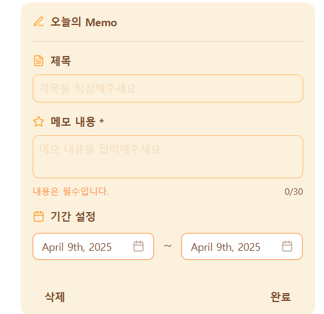
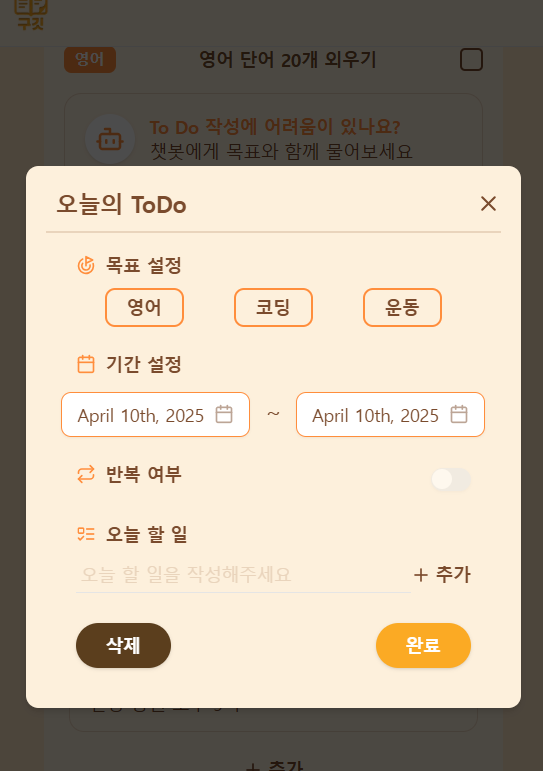

## Explain this Pull Request 🙏

- Jira URL:https://9git-9git.atlassian.net/browse/SCRUM-26

## What has fixed? 🛠

<<<<<<< HEAD
변경 전

변경 후
=======
main 페이지 마크업한 화면입니다.
폰트, 간격 등의 디자인 요소는 추가적으로 고려가 필요하지만
리뷰를 통한 수정 가능성과 추가 작업이 필요한 페이지(분석페이지)를 고려하여 우선 코드 리뷰를 받고자 합니다.
>>>>>>> 2b6b53c (md 파일 수정)

## Whether needed review 🖍

<!-- 마크다운의 빈 체크박스 문법은 [ ] / 채워진 체크박스 문법은 [x] 입니다. -->

- [x] 🙋🏻 리뷰가 필요합니다!
- [ ] 🙅🏻 리뷰가 필요하지 않습니다!

(이유 : Main 페이지 마크업 코드 리뷰)

## Document🗒️ (Optional)

## Screenshot 📸 (Optional)

## Test Checklist ✅ (Optional)

<!-- 마크다운의 빈 체크박스 문법은 [ ] / 채워진 체크박스 문법은 [x] 입니다. -->
